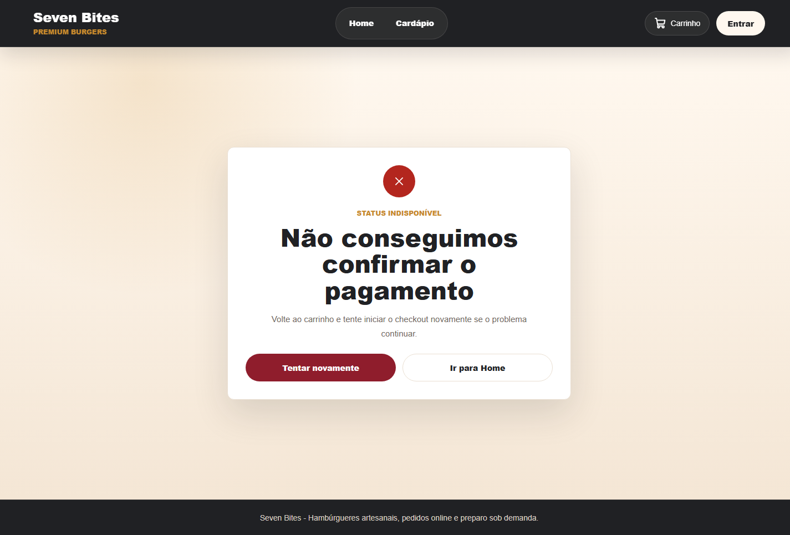
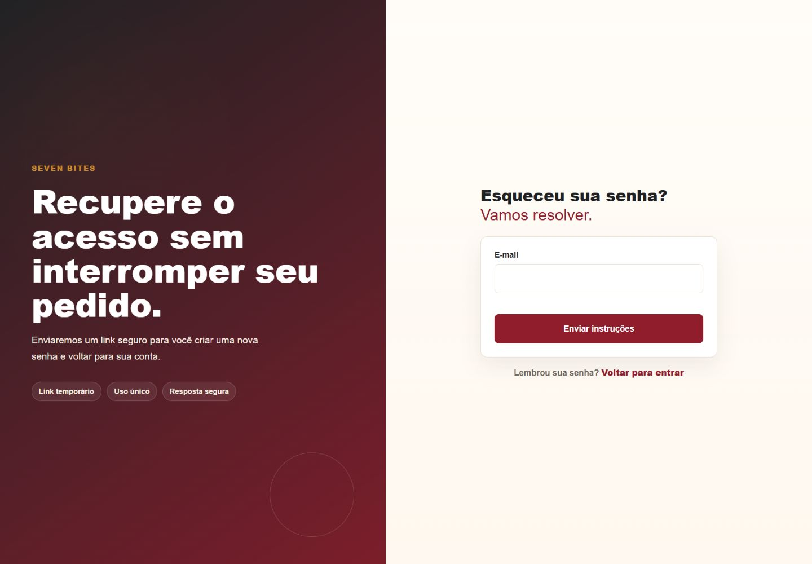
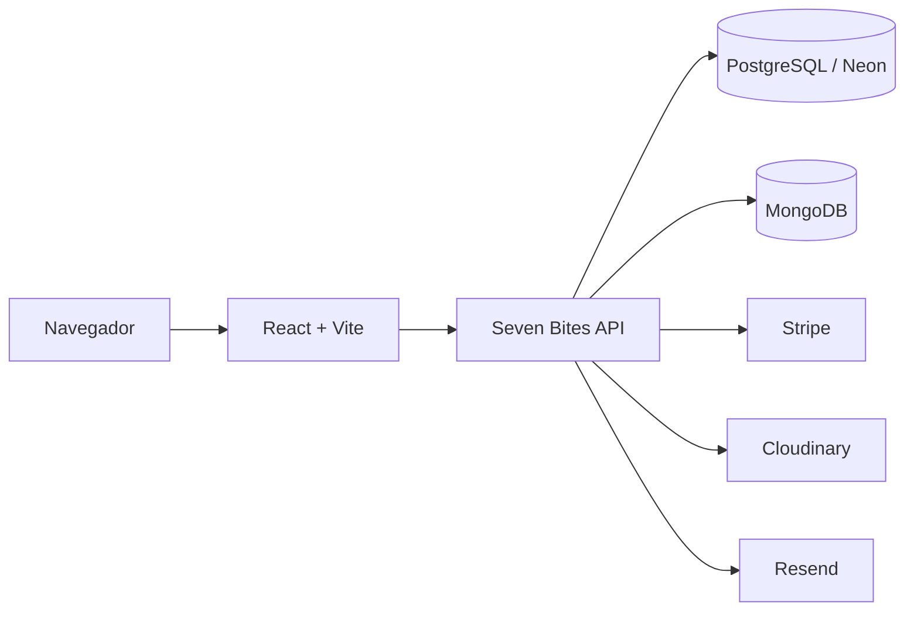
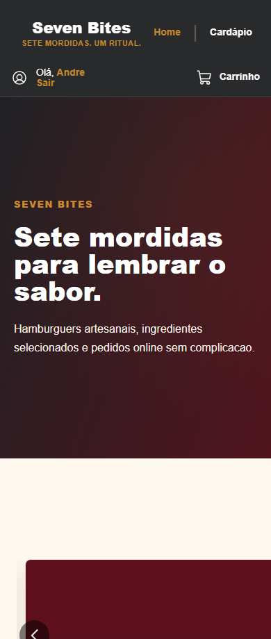
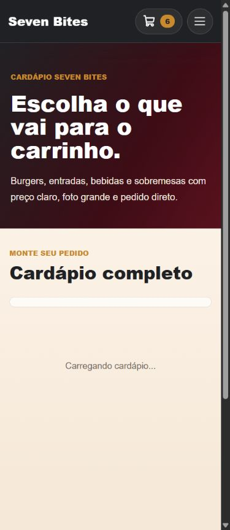
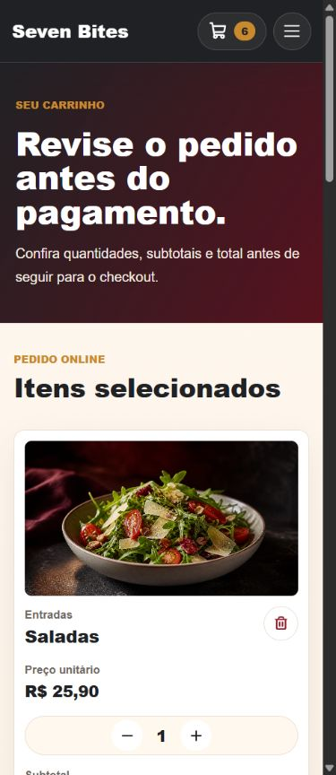

# Seven Bites

Seven Bites e uma plataforma web fullstack para uma hamburgueria premium fast-casual, com vitrine comercial, cardapio, carrinho, autenticacao, recuperacao de senha, checkout com Stripe e painel administrativo.

O projeto foi construido como produto de portfolio, simulando uma aplicacao comercial real para venda online, gestao de catalogo e acompanhamento de pedidos.

## Preview

<p align="center">
  
</p>

## Sobre o projeto

A aplicacao publica apresenta a marca, organiza produtos por categoria, permite montar pedidos, manter o carrinho entre sessoes e finalizar a compra com pagamento integrado. O painel administrativo protege operacoes internas e permite gerenciar produtos, imagens, pedidos e status.

O frontend foi desenvolvido com foco em identidade visual propria, responsividade real, acessibilidade, consistencia de componentes e integracao segura com a API.

## Experiencia do cliente

<p align="center">
  
  
  
</p>

- Home comercial com identidade Seven Bites.
- Cardapio com categorias, filtros, ofertas e imagens finais.
- Carrinho persistente com ajuste de quantidade, remocao e totalizacao.
- Checkout com resumo do pedido, taxa de entrega e Stripe Test Mode.
- Confirmacao final apos pagamento validado.

## Autenticacao

<p align="center">
  
  
  
</p>

- Cadastro e login com validacao de formulario.
- Sessao autenticada com JWT.
- Recuperacao de senha por e-mail com link temporario.
- Redirecionamento para login quando o checkout exige autenticacao.

## Principais funcionalidades

- Vitrine publica responsiva.
- Catalogo com produtos, categorias, precos, ofertas e imagens finais.
- Carrinho com persistencia local e atualizacao de badge.
- Checkout integrado ao Stripe Elements.
- Criacao de pedidos com calculo validado no servidor.
- Fluxos de sucesso, processamento e falha no pagamento.
- Rotas protegidas para usuario autenticado e administrador.

## Painel administrativo

<p align="center">
  
  
</p>

- Listagem e filtro de pedidos por status.
- Detalhamento e atualizacao de pedidos.
- Listagem, criacao e edicao de produtos.
- Upload de imagens para produtos e categorias.
- Guards de rota e autorizacao administrativa no backend.

## Tecnologias

- React
- Vite
- JavaScript
- styled-components
- React Router
- Context API
- Axios
- React Hook Form
- Yup
- Stripe React / Stripe JS
- Material UI
- Phosphor Icons
- Biome

## Arquitetura



```txt
seven-bites-interface
|-- docs
|   `-- screenshots
|-- public
|-- src
|   |-- components
|   |-- config
|   |-- containers
|   |-- hooks
|   |-- layouts
|   |-- routes
|   |-- services
|   |-- styles
|   `-- utils
|-- package.json
|-- vercel.json
`-- vite.config.js
```

O frontend concentra a experiencia do cliente e do administrador. Regras sensiveis, como precos, totais, autorizacao e criacao de pedidos, sao validadas pela API.

## Seguranca e integracoes

- API propria em Node.js e Express.
- Autenticacao com JWT.
- Rotas administrativas protegidas por autorizacao no servidor.
- Precos, subtotal, taxa de entrega e total validados no backend.
- Criacao de pedido protegida por idempotencia de pagamento.
- Stripe em Test Mode para pagamento no projeto demo.
- Cloudinary para imagens finais do catalogo.
- Resend para e-mails de recuperacao de senha.
- Segredos gerenciados por variaveis de ambiente.

## Responsividade

<p align="center">
  
  
  
</p>

A interface foi validada em desktop, tablet e mobile, com navegacao adaptada, grids responsivos, areas clicaveis adequadas e preservacao dos fluxos principais.

## Aplicacao

- Frontend: https://sevenbites.vercel.app
- API: https://seven-bites-api.onrender.com
- Repositorio da API: https://github.com/branchescunha/seven-bites-api

## Autor

Andre Vinicius Branches Cunha
