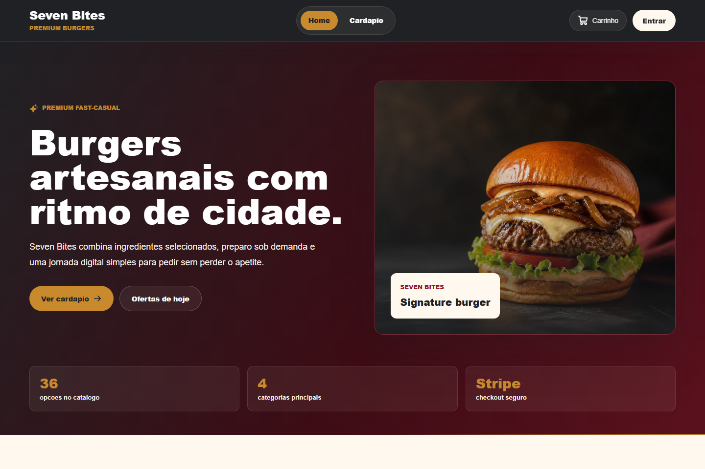
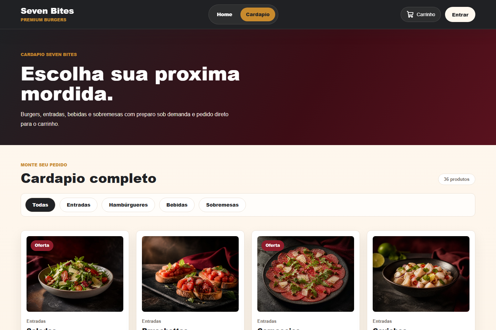
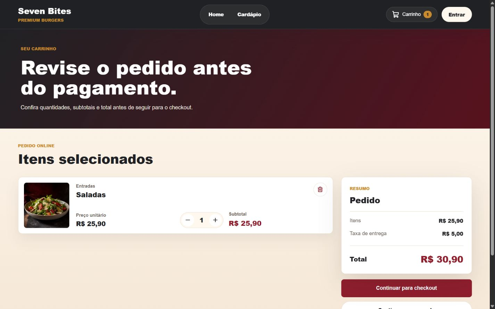
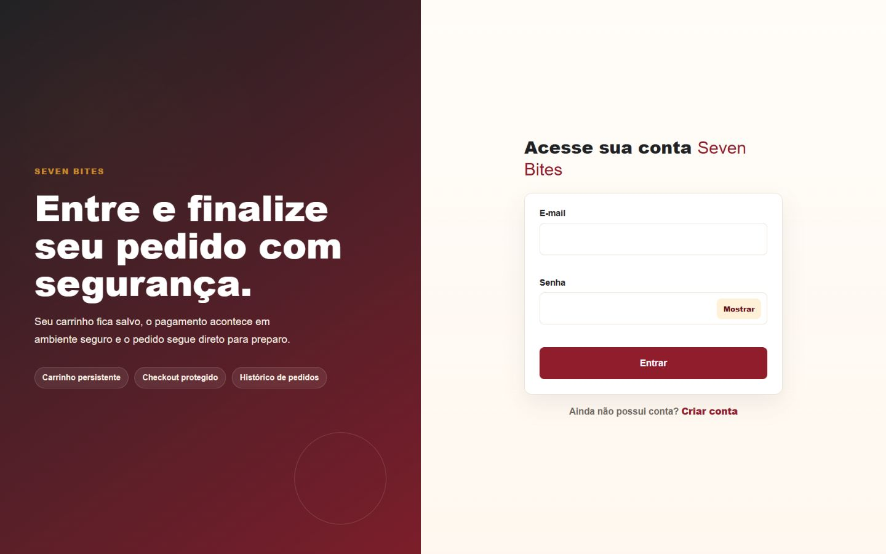
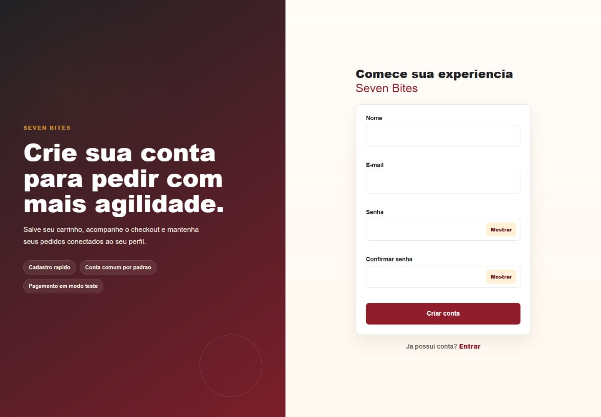
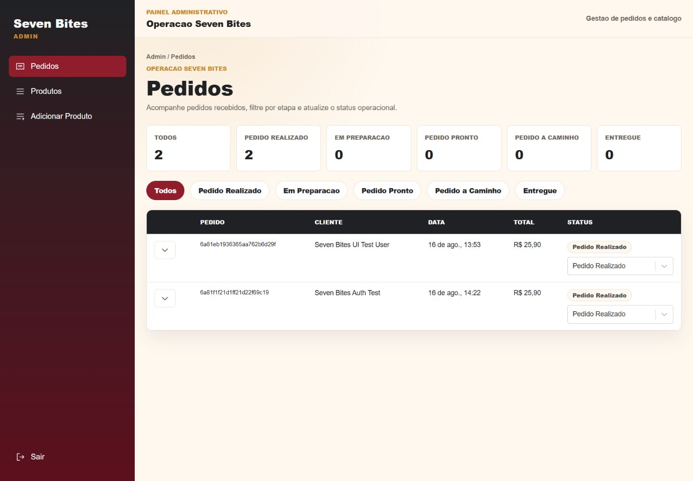
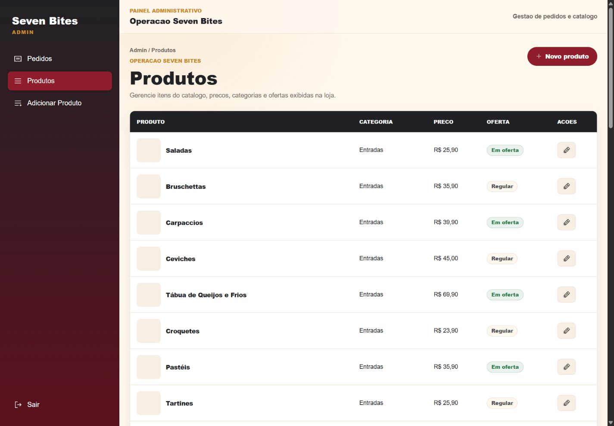

# Seven Bites

Seven Bites e uma aplicacao full stack para venda online e operacao administrativa de uma hamburgueria premium fast-casual.

Projeto desenvolvido como produto de portfolio, com experiencia publica para clientes, checkout com pagamento integrado e painel administrativo protegido.

**Links:** [Aplicacao](https://sevenbites.vercel.app) · [API](https://seven-bites-api.onrender.com) · [Repositorio da API](https://github.com/branchescunha/seven-bites-api)

## Preview

<p align="center">
  
</p>

## Sobre o projeto

O Seven Bites resolve o fluxo digital principal de um restaurante: apresentar o catalogo, receber pedidos, autenticar clientes, processar pagamento e registrar a compra no backend.

A experiencia publica cobre Home, cardapio, carrinho, login, cadastro, recuperacao de senha, checkout e confirmacao do pedido. A operacao administrativa permite acompanhar pedidos e gerenciar o catalogo com controle de acesso.

O projeto foi construido com frontend em React, API propria em Node.js, persistencia em PostgreSQL e MongoDB, imagens no Cloudinary, e-mails pelo Resend e pagamentos em Stripe Test Mode.

## Experiencia do cliente

### Cardapio

<p align="center">
  
</p>

O cardapio organiza produtos por categorias, destaca ofertas, exibe imagens finais e permite adicionar itens ao carrinho com feedback visual.

### Carrinho e checkout

<p align="center">
  
</p>

O fluxo segue a jornada Cardapio -> Carrinho -> Checkout -> Pedido. O carrinho mantem os itens entre sessoes, permite ajustar quantidades e envia o pedido para um checkout autenticado com Stripe Elements.

## Autenticacao

<p align="center">
  
  
</p>

Login e cadastro seguem a identidade visual do produto e preservam validacao de formulario, sessao autenticada, redirecionamento para checkout e recuperacao de senha por e-mail.

## Painel administrativo

<p align="center">
  
  
</p>

A area administrativa e protegida por autenticacao e autorizacao. Ela permite acompanhar pedidos, atualizar status, consultar detalhes, gerenciar produtos, cadastrar novos itens e manter imagens do catalogo.

## Funcionalidades

### Cliente

- Catalogo por categorias.
- Carrinho persistente.
- Autenticacao e recuperacao de senha.
- Checkout com Stripe Elements.
- Pagamento em ambiente de teste.
- Registro e confirmacao do pedido.
- Interface responsiva para desktop, tablet e mobile.

### Administracao

- Autenticacao e autorizacao administrativa.
- Gerenciamento de pedidos.
- Atualizacao de status.
- Gerenciamento do catalogo.
- Criacao e edicao de produtos.
- Upload de imagens.

## Tecnologias

### Frontend

- React
- Vite
- styled-components
- React Router
- Axios
- React Hook Form
- Yup
- React Toastify
- Stripe.js

### Backend e dados

- Node.js
- Express
- PostgreSQL / Neon
- MongoDB / Mongoose

### Servicos

- Stripe
- Cloudinary
- Resend
- Vercel
- Render

## Arquitetura

```txt
Cliente web
  -> Seven Bites Interface
  -> Seven Bites API
  -> PostgreSQL / MongoDB
  -> Stripe / Cloudinary / Resend
```

O frontend concentra a experiencia de cliente e administrador. A API centraliza regras sensiveis, como autenticacao, autorizacao, calculo de valores, criacao de pedidos, pagamento, envio de e-mails e integracao com servicos externos.

Estrutura essencial:

```txt
seven-bites-interface
|-- docs/screenshots
|-- src
|   |-- components
|   |-- containers
|   |-- hooks
|   |-- layouts
|   |-- routes
|   |-- services
|   `-- styles
|-- package.json
`-- vite.config.js
```

## Seguranca e integracoes

- Autenticacao com JWT.
- Senhas protegidas por hash no backend.
- Rotas administrativas protegidas por autorizacao.
- Recuperacao de senha com token temporario.
- Calculo de subtotal, taxa de entrega e total validado no servidor.
- Pagamento integrado ao Stripe em Test Mode.
- Imagens armazenadas no Cloudinary.
- E-mails transacionais enviados pelo Resend.

## Responsividade

A interface foi desenvolvida com layouts responsivos para desktop, tablet e dispositivos moveis, incluindo adaptacoes especificas de navegacao, catalogo, carrinho e autenticacao.

## Links do projeto

- Aplicacao em producao: https://sevenbites.vercel.app
- API em producao: https://seven-bites-api.onrender.com
- Repositorio da API: https://github.com/branchescunha/seven-bites-api

## Autor

André Vinícius Branches Cunha
